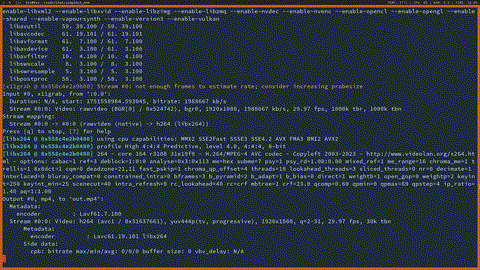

# Demo



# Description

A really simple terminal based chatroom programm where all communication is AES ciphered.

# Requirements

- `ncurses.h`
- `SDL2/SDL.h`
- `openssl/evp.h`

# setting up

## AES Key

Server, side, modify the key at line `267` and `289`

Client side, modify the key at line `18`

Server side:

Just `gcc chat_server.c -lcrypto -o chat_server`

Client side:

Just `gcc chat_client.c -lncurses -lpthread -lcrypto $(sdl2-config --cflags --libs) -o chat_client`

For the admin, set credentials of allowed accounts:

```
gcc setup_passwords.c -o setup_passwords
./setup_passwords
Enter chatroom file:
Enter username:
Enter pasword:
```

Now start the server:

```
./chat_server
```

And the client:

```
./chat_client server_ip port username password chatroom_name
```

Note: chatrooms are created on the fly while a client is connecting

# What you can do ?

- Write messages 
- Delete characters
- poke 

**Happy chatting!!!**


