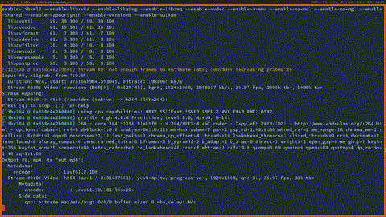

# Demo



# What bring this version ?

AES encryption for all communication

# How to use it ?

Server side:

Just `gcc chat_server.c -o chat_server`

Client side:

Just `gcc chat_client.c -lncurses -lpthread -o chat_client`

For the admin, set credentials of allowed accounts:

```
gcc setup_passwords.c -o setup_passwords
./setup_passwords
Enter chatroom file:
Enter username:
Enter pasword:
```

Now start the server:

```
./chat_server
```

And the client:

```
./chat_client server_ip port username password chatroom_name
```

Note: chatrooms are created on the fly while a client is connecting

**Happy chatting!!!**


